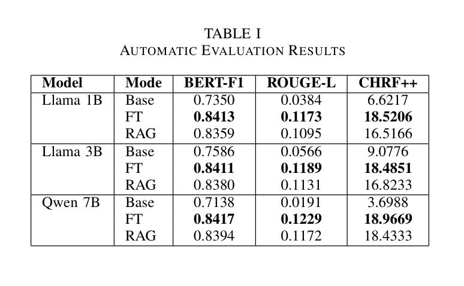
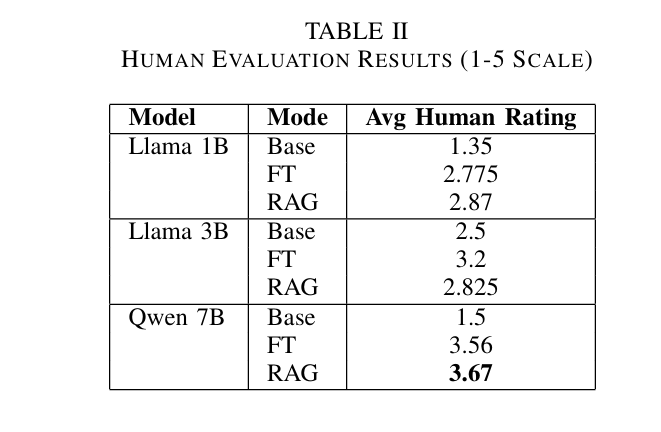

# Roman-Urdu-Medical-LLM

  <a href="assets/docs/Roman-Urdu-Medical-LLM-Report.pdf"><b>📄 Read Full Report</b></a>
  &nbsp;&nbsp;&nbsp;|&nbsp;&nbsp;&nbsp;
  <a href="assets/docs/Roman-Urdu-Medical-LLM-Presentation.pdf"><b>📊 View Presentation Slides</b></a>

A roman urdu medical chatbot for symptoms analysis and general medical advice.

## Abstract:
Digital access to accurate medical information, especially in regional languages such as Urdu/Roman Urdu, is scarce. While modern-day LLMs excel at general tasks, they often underperform in domain-specific tasks, such as medical diagnosis. They're also very compute-intensive and may not work well in non-standard languages like Roman Urdu. Given the excessive use of Roman Urdu in the digital space over the standard Urdu script, we fine-tune three different open-source LLMs on a custom Roman Urdu dataset for the medical domain and complement it with a hybrid RAG system for accurate medical advice. We evaluate our models using automatic evaluation metrics, such as the BERT-F1 score and chrF++, as well as human evaluation. We found that the fine-tuned qwen-2.5-7B gave the best results with reasonable inference time.

## Key features:
- **Custom Dataset:** We created a parallel corpus by translating ~26k+ medical QA pairs using `gpt-4o-mini`.
- **Efficient Fine-Tuning:** We utilized LoRA (Low-Rank Adaptation) and Unsloth to fine-tune models on limited compute (T4 GPU).
- **Hybrid RAG Pipeline:** For better results, we combined semantic search with exact keyword matching to distinguish between similar ailments (e.g., "stomach pain" vs. "joint pain").
## Performance
Our fine-tuned **Qwen2.5-7B** model with RAG achieved the highest human evaluation score, significantly outperforming 1B and 3B base models which struggled with the Roman Urdu script. The Qwen2.5-7B without RAG also performed decently and in some cases, even better than the one with RAG (because the RAG one got confused sometimes and hallucinated due to information overload).

### Automatic Evaluation (BERT-F1, ROUGE-L, chrF++)

### Human Evaluation (1-5 Scale)

## Saved Models:
The three fine-tuned models were saved to hugging face for easier access:
1. [Llama-1B](https://huggingface.co/farazahmad2004/NLP-Medical-Chatbot-Llama-1B)
2. [Llama-3B](https://huggingface.co/farazahmad2004/NLP-Medical-Chatbot-Llama-3B)
3. [Qwen-7B](https://huggingface.co/farazahmad2004/NLP-Medical-Chatbot-Qwen-7B)

## Requirements:
For requirements, makes sure to install all the libraries that are in **Setup** Cell of the notebooks, mainly:
- unsloth
- sentence-transformers
- langchain
- transformers
- evaluate
- bert_score
- datasets

**Note:** This list is not comprehensive.
Regarding running, we have an `app.py` file in `code` folder, that runs Llama-1B for testing, but for faster inference, higher RAM and a GPU will be required. Please refer to the outputs generated in the evaluation section of notebooks to see sample outputs.
